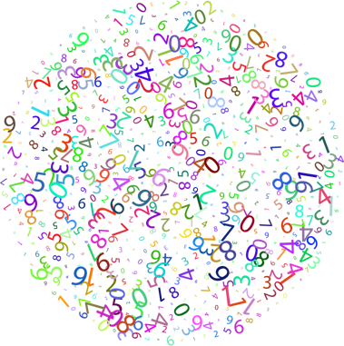

# Raad een getal

Maak een spel waarin de speler een getal moet raden. 

[Start](stap_1.md)

Alle stappen:

1. [Toon een tekst](stap_1.md)
2. [Genereer een random getal](stap_2.md)
3. [Vraag de speler om een getal](stap_3.md)
4. [Kijk of het getal goed is geraden](stap_4.md)
5. [Laat de speler meerdere keren raden](stap_5.md)
6. [Breid het spel zelf verder uit](stap_6.md)

